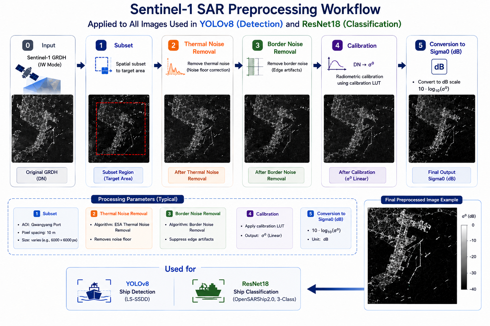
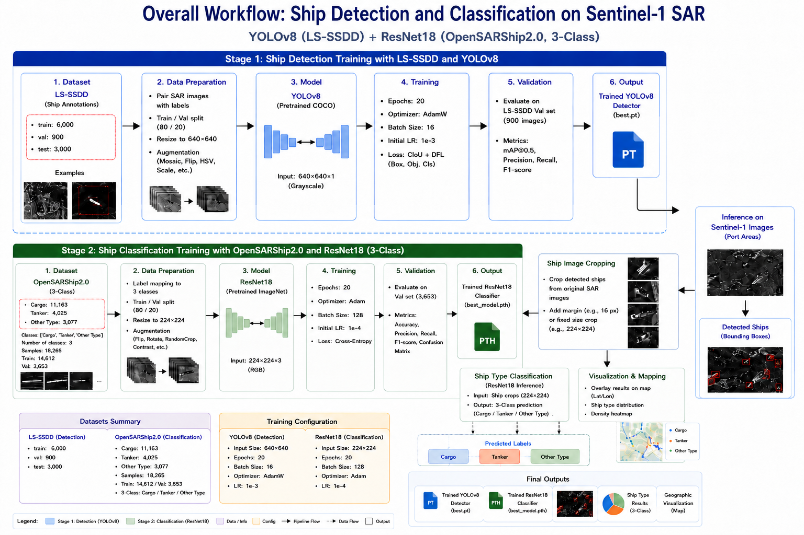
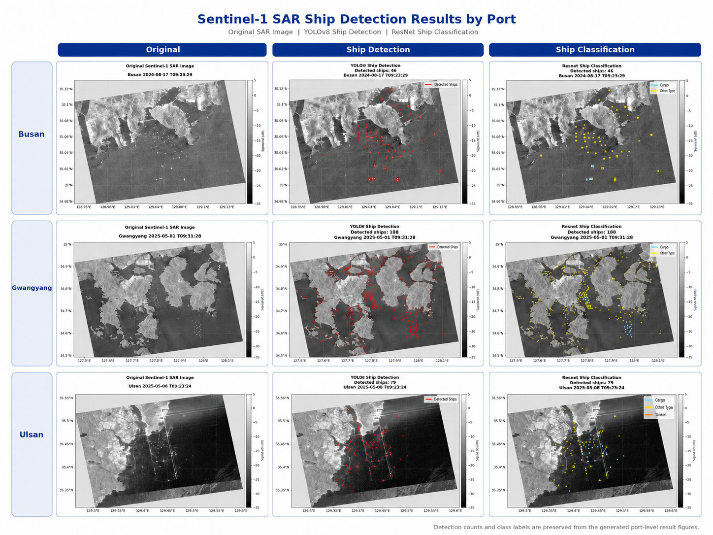

# Sentinel-1 SAR Ship Detection and Classification

YOLOv8-based ship detection and ResNet-based ship type classification using Sentinel-1 SAR imagery.

## Overview

This project presents an end-to-end deep learning workflow for automatic ship detection and ship type classification in Sentinel-1 Synthetic Aperture Radar (SAR) imagery.

The proposed workflow consists of two main stages. First, a YOLOv8 ship detector is trained using the LS-SSDD dataset to detect ship targets from SAR imagery. Second, detected ship regions are cropped and passed to a ResNet-based classifier trained using the OpenSARShip2.0 dataset to classify ship types.

The trained models are applied to Sentinel-1 SAR images acquired over major Korean port areas, including Busan Port, Gwangyang Port, and Ulsan Port. The final outputs include georeferenced ship detection maps and ship type classification maps overlaid on Sentinel-1 Sigma0 VV images.

This project is intended as a practical SAR-based maritime monitoring pipeline that combines object detection, ship chip classification, and geographic visualization.

---

## Highlights

* Sentinel-1 SAR ship detection and classification pipeline
* YOLOv8-based ship detector trained on LS-SSDD
* ResNet-based ship type classifier trained on OpenSARShip2.0
* Ship type classification into three classes:

  * Cargo
  * Tanker
  * Other Type
* Application to large Sentinel-1 SAR port scenes
* Georeferenced visualization using longitude-latitude grids
* Tested on Korean port areas:

  * Busan Port
  * Gwangyang Port
  * Ulsan Port
* End-to-end workflow from Sentinel-1 preprocessing to final ship type mapping

---

## Repository Structure

```text
Sentinel1_SAR_Ship_Detection_Classification/
├── scripts/
│   ├── Preparation_OpenSARShip2.ipynb
│   ├── Train_YOLO_LS_SSDD.ipynb
│   ├── Train_Resnet_ship_class.ipynb
│   ├── Visualization_YOLO.ipynb
│   ├── Visualization_YOLO_Resnet.ipynb
│
├── figures/
│   ├── Model_Training_Workflow.png
│   ├── Sentinel1_SAR_Preprocessing_Workflow.png
│   ├── Ship_Detection_Classification_Result.png
│   ├── Busan_Ship_Detection_Result.png
│   ├── Gwangyang_Ship_Detection_Result.png
│   ├── Ulsan_Ship_Detection_Result.png
│   ├── Busan_Ship_Classification_Result.png
│   ├── Gwangyang_Ship_Classification_Result.png
│   └── Ulsan_Ship_Classification_Result.png
│
├── MATLAB/
│   └── Mapping_Sentinel1.m
│
├── trained_models/
│   ├── ls_ssdd_yolov8s_20epoch_best.pt
│   └── opensarship2_resnet18_3class_ship_classifier.pt
│
├── requirements.txt
├── LICENSE
├── .gitignore
└── README.md
```

---

## Objectives

The main objectives of this project are:

1. To train a YOLOv8 ship detector using the LS-SSDD SAR ship detection dataset.
2. To train a ResNet-based ship type classifier using the OpenSARShip2.0 dataset.
3. To apply the trained detector and classifier to Sentinel-1 SAR images over major port areas.
4. To generate georeferenced ship detection and ship classification maps.
5. To evaluate the feasibility of combining SAR ship detection and ship type classification for port monitoring.

---

## Data

The trained model was applied to several unseen Sentinel-1 images:

Busan (2024-08-17): S1A_IW_GRDH_1SDV_20240817T092329_20240817T092358_055251_06BC37_1A3B

Gwangyang (2025-05-01): S1A_IW_GRDH_1SDV_20250501T093128_20250501T093157_058999_075136_20F1

Ulsan (2025-05-08): S1A_IW_GRDH_1SDV_20250508T092324_20250508T092353_059101_075525_2036


---

## Sentinel-1 SAR Preprocessing

All Sentinel-1 SAR images used for inference were preprocessed before being applied to the ship detection and classification models.

The preprocessing steps are:

1. Subset
2. Thermal Noise Removal
3. Border Noise Removal
4. Radiometric Calibration
5. Conversion to Sigma0 (dB)

The preprocessed Sentinel-1 Sigma0 VV images were then mapped onto longitude-latitude grids for georeferenced visualization.



### Preprocessing Details

The Sentinel-1 preprocessing workflow was designed to improve radiometric consistency and reduce SAR-specific noise artifacts.

* **Subset**
  The original Sentinel-1 GRDH image was spatially subset to the target port area.

* **Thermal Noise Removal**
  Thermal noise was removed to suppress sensor-related noise contributions.

* **Border Noise Removal**
  Border artifacts near the image edges were removed.

* **Radiometric Calibration**
  Digital number values were converted into calibrated backscatter coefficients.

* **Conversion to Sigma0 (dB)**
  Calibrated Sigma0 values were converted to decibel scale using:

```text
Sigma0(dB) = 10 × log10(Sigma0)
```

---

## Datasets

This project uses two public SAR ship datasets.

---

## 1. LS-SSDD Dataset

The LS-SSDD dataset was used for ship detection model training.

### Purpose

LS-SSDD was used to train the YOLOv8 ship detector. The dataset provides SAR ship annotations suitable for object detection.

### Dataset Statistics

```text
Train: 6,000 images
Validation: 900 images
Test: 3,000 images
```

### Usage in This Project

The LS-SSDD dataset was converted into YOLO format. Each SAR image was paired with a corresponding ship bounding box annotation.

The YOLOv8 model was trained to detect a single object class:

```text
Class 0: Ship
```

### Example Directory Structure

```text
LS-SSDD/
├── Annotations_sub/
├── JPEGImages_sub_train/
├── JPEGImages_sub_test/
├── train.txt
├── val.txt
└── test.txt
```

---

## 2. OpenSARShip2.0 Dataset

The OpenSARShip2.0 dataset was used for ship type classification model training.

### Purpose

OpenSARShip2.0 was used to train a ResNet-based classifier for ship type classification.

### Selected Classes

Although OpenSARShip2.0 contains multiple ship categories, this project uses three major classes for practical classification:

```text
Cargo
Tanker
Other Type
```

### Dataset Statistics Used in This Project

```text
Cargo: 11,163 samples
Tanker: 4,025 samples
Other Type: 3,077 samples

Total samples: 18,265
Training samples: 14,612
Validation samples: 3,653
```

### Why Three Classes?

Initial experiments were performed using more detailed ship type classes. However, the original class distribution was highly imbalanced. Several minor classes had very few samples, which caused unstable classification performance.

Therefore, the classification task was simplified into three major classes:

* Cargo
* Tanker
* Other Type

This configuration provided a better balance between class interpretability and classification stability.

### Example Directory Structure

```text
OpenSARShip2/
├── S1A_IW_GRDH_1SDH_YYYYMMDDTXXXXXX_.../
│   ├── Metadata.xml
│   ├── Ship.xml
│   ├── Patch/
│   ├── Patch_cal/
│   ├── Patch_RGB/
│   └── Patch_Uint8/
│
├── S1A_IW_GRDH_1SDV_YYYYMMDDTXXXXXX_.../
│   ├── Metadata.xml
│   ├── Ship.xml
│   ├── Patch/
│   ├── Patch_cal/
│   ├── Patch_RGB/
│   └── Patch_Uint8/
```

In this project, ship chips were collected from the available patch folders using the following priority:

```text
Patch_Uint8
Patch_RGB
Patch_cal
Patch
```

---

## Models

This project uses two deep learning models.

---

## 1. YOLOv8 Ship Detection Model

### Model

```text
YOLOv8s
```

### Task

```text
SAR ship detection
```

### Input

```text
640 × 640 SAR image patches
```

### Training Configuration

```text
Dataset: LS-SSDD
Model: YOLOv8s
Input size: 640 × 640
Epochs: 20
Batch size: 16
Optimizer: AdamW
Initial learning rate: 1e-3
Loss: CIoU + DFL
Classes: Ship
```

### Output

```text
ls_ssdd_yolov8s_20epoch_best.pt
ls_ssdd_yolov8s_20epoch_last.pt
```

The trained YOLOv8 model detects ships from large Sentinel-1 SAR images using a sliding-window inference strategy.

---

## 2. ResNet Ship Type Classification Model

### Model

```text
ResNet18
```

### Task

```text
Ship type classification
```

### Input

```text
224 × 224 RGB ship chips
```

### Training Configuration

```text
Dataset: OpenSARShip2.0
Model: ResNet18
Pretraining: ImageNet
Input size: 224 × 224
Epochs: 20
Batch size: 128
Optimizer: Adam
Initial learning rate: 1e-4
Loss: Cross-Entropy Loss
Classes: Cargo / Tanker / Other Type
```

### Output

```text
opensarship2_resnet18_3class_ship_classifier.pt
```

---

## Training Workflow



---

## Stage 1: YOLOv8 Ship Detection Training

In the first stage, the YOLOv8s object detection model was trained using the LS-SSDD dataset.

The objective of this stage was to build a SAR ship detector capable of identifying ship targets from Sentinel-1-like SAR imagery.

### Training Procedure

1. Load LS-SSDD images and annotations.
2. Convert annotations into YOLO format.
3. Split the dataset into training and validation sets.
4. Train YOLOv8s for 20 epochs.
5. Save the best and last model checkpoints.
6. Apply the trained model to Sentinel-1 SAR images.

### Output

```text
Trained YOLOv8 ship detector
```

---

## Stage 2: ResNet Ship Type Classification Training

In the second stage, a ResNet18 classifier was trained using OpenSARShip2.0 ship chip images.

The objective of this stage was to classify detected ship targets into three major ship categories.

### Training Procedure

1. Load ship chip images from OpenSARShip2.0.
2. Parse ship type labels from file names.
3. Select the following three classes:

   * Cargo
   * Tanker
   * Other Type
4. Resize ship chips to 224 × 224.
5. Train a ResNet18 classifier for 20 epochs.
6. Save the best classification model checkpoint.
7. Apply the classifier to YOLO-detected ship crops.

### Output

```text
Trained ResNet18 ship type classifier
```

---

## Inference Pipeline

The inference pipeline combines YOLOv8 ship detection and ResNet ship classification.

### Step 1: Load Sentinel-1 SAR Image

The preprocessed Sentinel-1 image is loaded from a MAT file containing:

```text
sigma_naught
xx
yy
```

where:

* `sigma_naught`: Sentinel-1 Sigma0 VV backscatter image
* `xx`: longitude grid
* `yy`: latitude grid

### Step 2: Convert SAR Image to Model Input

The Sigma0 image is converted into an 8-bit image for YOLOv8 inference.

### Step 3: Sliding-Window Ship Detection

YOLOv8 is applied to large Sentinel-1 SAR scenes using a sliding-window strategy.

Detected bounding boxes are merged and filtered using:

* Confidence threshold
* Box area threshold
* Non-maximum suppression

### Step 4: Ship Crop Extraction

For each detected ship, a fixed-size crop is extracted around the YOLO bounding box center.

This fixed-size crop strategy was used to reduce inconsistencies between small YOLO bounding boxes and OpenSARShip2.0 ship chips.

### Step 5: Ship Type Classification

Each ship crop is resized and passed to the ResNet18 classifier.

The classifier predicts one of the following classes:

```text
Cargo
Tanker
Other Type
```

### Step 6: Georeferenced Visualization

Bounding boxes are converted from pixel coordinates to longitude-latitude coordinates using the `xx` and `yy` grids.

The final results are visualized on georeferenced Sentinel-1 Sigma0 VV maps.

---

## Application Areas

The trained models were applied to Sentinel-1 SAR images acquired over three major Korean port areas.

```text
Busan Port
Gwangyang Port
Ulsan Port
```

---

## Results

The final output includes three types of figures for each port:

1. Original Sentinel-1 SAR image
2. YOLOv8 ship detection result
3. ResNet ship classification result



---

## Port-Level Results

### Busan Port


```text
Acquisition date: 2024-08-17
Detected ships: 46
```

The Busan result shows ship detections mainly distributed in coastal waters and port-adjacent areas. The ResNet classifier assigned most detected ships to the Other Type class, with a smaller number of Cargo predictions.

---

### Gwangyang Port


```text
Acquisition date: 2025-05-01
Detected ships: 188
```

The Gwangyang result shows the highest number of detected ships among the three test areas. Many detections are concentrated around inner port channels and anchorage areas.

---

### Ulsan Port


```text
Acquisition date: 2025-05-08
Detected ships: 79
```

The Ulsan result shows ship detections distributed around the industrial port area and offshore anchorage zones. Compared with Busan and Gwangyang, the Ulsan classification result includes Cargo, Tanker, and Other Type predictions.

---

## Ship Detection Result Summary

```text
Busan Port: 46 ships
Gwangyang Port: 188 ships
Ulsan Port: 79 ships
```

---

## Model Performance

### ResNet18 Ship Classification Performance

The ResNet18 classifier was evaluated on the OpenSARShip2.0 validation set.

Example validation result:

```text
Accuracy: approximately 0.70
```

Class-level performance showed that Cargo was classified more reliably than Tanker and Other Type. Tanker and Other Type remained more difficult to separate, likely due to similar SAR backscatter patterns, limited visual structure in ship chips, and domain differences between OpenSARShip2.0 chips and YOLO-cropped Sentinel-1 ship targets.

### Important Note

The ship type classification results should be interpreted as experimental outputs. The classification maps were not independently validated using AIS data in this project. Therefore, the ship detection results are more reliable than the ship type classification results.

---

## Key Findings

1. YOLOv8 trained on LS-SSDD can detect ships from large Sentinel-1 SAR images.
2. Sliding-window inference enables ship detection over wide-area SAR scenes.
3. OpenSARShip2.0 can be used to train a ship type classifier for Sentinel-1 SAR ship chips.
4. Three-class classification is more stable than highly detailed ship type classification.
5. Domain differences exist between OpenSARShip2.0 ship chips and YOLO-cropped Sentinel-1 ship targets.
6. Fixed-size crop extraction improves the stability of ship type classification.
7. Georeferenced visualization allows detected ships to be mapped directly onto latitude-longitude grids.
8. Additional AIS validation is required for rigorous ship type assessment.

---

## Limitations

This project has several limitations.

### 1. No AIS-Based Validation

The ship type classification results were not validated using AIS data. Therefore, the classification output should be regarded as experimental.

### 2. Domain Gap

The OpenSARShip2.0 training chips and YOLO-cropped ship regions from Sentinel-1 port scenes may have different spatial contexts, image sizes, and background conditions.

### 3. Class Imbalance

OpenSARShip2.0 contains strong class imbalance. Cargo samples dominate the dataset, while several ship types have very few samples.

### 4. Limited Ship Classes

This project uses three ship classes:

```text
Cargo
Tanker
Other Type
```

More detailed ship type classification requires additional balanced training data.

### 5. False Positives

Some bright SAR targets, coastal structures, or port facilities may be misdetected as ships.

---

## Future Work

Future improvements may include:

* AIS-based validation of detected ships and classified ship types
* Expansion to additional Korean and international ports
* Multi-temporal ship density monitoring
* Improved ship crop normalization
* Training with OpenSARShip1.0 and OpenSARShip2.0 combined
* Transformer-based SAR ship classification
* Few-shot learning for rare ship types
* Domain adaptation between OpenSARShip chips and YOLO-detected Sentinel-1 crops
* Integration with port activity monitoring systems
* Near-real-time Sentinel-1 maritime surveillance

---

## Installation

Clone this repository:

```bash
git clone https://github.com/jinhonav/Sentinel1-SAR-Ship-Detection-Classification.git
cd Sentinel1-SAR-Ship-Detection-Classification
```

Install the required packages:

```bash
pip install -r requirements.txt
```

---

## Requirements

The notebooks were developed and tested in Google Colab.

Main dependencies:

```text
Python
PyTorch
TorchVision
Ultralytics
OpenCV
NumPy
SciPy
Matplotlib
Cartopy
scikit-learn
tqdm
Pillow
```

Example installation:

```bash
pip install torch torchvision ultralytics opencv-python numpy scipy matplotlib cartopy scikit-learn tqdm pillow
```

---

## Data Availability

The datasets used in this project are not included in this repository.

Users should download the datasets from their original sources.

### LS-SSDD

Used for SAR ship detection training.

### OpenSARShip2.0

Used for SAR ship type classification training.

### Sentinel-1 SAR Images

Sentinel-1 SAR images can be downloaded from the Copernicus Data Space Ecosystem.

---

## Notes

The provided notebooks were developed in Google Colab. Users may need to modify Google Drive paths according to their own environment.

Large Sentinel-1 SAR scenes, LS-SSDD images, OpenSARShip2.0 ship chips, and trained model checkpoints are not included in this repository.

The trained models should be placed in:

```text
trained_models/
```

The figure files should be placed in:

```text
figures/
```

---

## References

[1] Zhang, T., Zhang, X., Li, J., Xu, X., Wang, B., Zhan, X., Xu, Y., Ke, X., Zeng, T., Su, H., Ahmad, I., Zhou, D., Pan, S., Li, C., Liu, Y., & Shi, J. LS-SSDD-v1.0: A deep learning dataset dedicated to small ship detection from large-scale Sentinel-1 SAR images. Remote Sensing.

[2] Li, B., Liu, B., Huang, L., Guo, W., Zhang, Z., & Yu, W. OpenSARShip 2.0: A large-volume dataset for deeper interpretation of ship targets in Sentinel-1 imagery.

[3] Jocher, G., Chaurasia, A., & Qiu, J. Ultralytics YOLOv8.

[4] He, K., Zhang, X., Ren, S., & Sun, J. Deep Residual Learning for Image Recognition. CVPR, 2016.

[5] European Space Agency. Sentinel-1 User Guide.

---

## License

This project is released under the MIT License.

The datasets used in this project remain subject to their respective licenses and terms of use.

---

## Author

Jinho Lee
Satellite Oceanography Laboratory
Seoul National University
